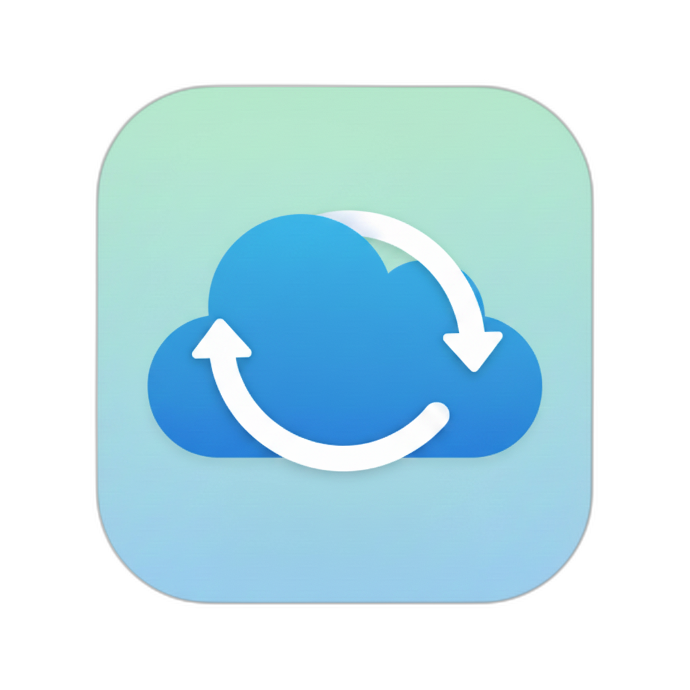

# Nextcloud Sync - Android Application



A native Android application for synchronizing files between your Android device and Nextcloud server using WebDAV.

## Technology Stack

- **Language**: Kotlin
- **UI**: XML Layouts with Material Design 3 Components
- **Architecture**: Model-View-Controller (MVC)
- **Database**: Room + SQLCipher for encrypted persistence
- **Network**: OkHttp + Sardine (WebDAV client)
- **Background Tasks**: WorkManager for periodic sync
- **Security**: Android Keystore, EncryptedSharedPreferences, TLS 1.2+

## Architecture

The app follows the **MVC (Model-View-Controller)** pattern with clear separation of concerns:

```
app/src/main/java/com/nextcloud/sync/
├── controllers/          # Business logic layer
│   ├── auth/            # Authentication controllers
│   └── sync/            # Sync controllers
├── models/              # Data layer
│   ├── data/            # Data classes and enums
│   ├── database/        # Room entities, DAOs, database
│   ├── network/         # WebDAV client, API models
│   └── repository/      # Data repositories
├── views/               # Presentation layer
│   ├── activities/      # Android activities
│   ├── adapters/        # RecyclerView adapters
│   └── fragments/       # Fragment views
├── services/workers/    # WorkManager background workers
├── utils/               # Utility classes
└── Application.kt       # Application class
```

**Key Features:**
- Two-way file synchronization via WebDAV
- AES-256 encrypted database (SQLCipher)
- TLS 1.2+ enforced for network security
- Two-factor authentication support
- User-prompted conflict resolution
- Background sync with WorkManager

## Build Instructions

### Prerequisites

- Android Studio Ladybug or later
- JDK 17
- Android SDK with API level 35
- Minimum target device: Android 8.0 (API 26)

### Building the Project

```bash
# Build the project
./gradlew build

# Build debug APK
./gradlew assembleDebug

# Build release APK
./gradlew assembleRelease

# Install on connected device/emulator
./gradlew installDebug

# Run unit tests
./gradlew test

# Run instrumentation tests
./gradlew connectedAndroidTest
```

### ProGuard Verification

After building a release APK, verify that logging is stripped:

```bash
if [ -f app/build/outputs/mapping/release/mapping.txt ]; then
  grep -i "safelogger\|android.util.log" app/build/outputs/mapping/release/mapping.txt
else
  echo "Mapping file not found - this is expected if ProGuard optimized away the classes completely"
fi
```

## Security Features

- **Encryption at Rest**: AES-256 via SQLCipher for database, Android Keystore for passwords
- **Encryption in Transit**: TLS 1.2+ enforced, certificate validation, no cleartext traffic
- **Authentication**: Password encryption (AES-GCM), 2FA support with app passwords

## License

This project is for demonstration purposes. Please ensure compliance with your Nextcloud server's terms of service and applicable laws when using this application.

## Credits

Built with [Room](https://developer.android.com/training/data-storage/room), [SQLCipher](https://www.zetetic.net/sqlcipher/), [Sardine-Android](https://github.com/thegrizzlylabs/sardine-android), [OkHttp](https://square.github.io/okhttp/), [WorkManager](https://developer.android.com/topic/libraries/architecture/workmanager), and [Material Components](https://material.io/develop/android).
